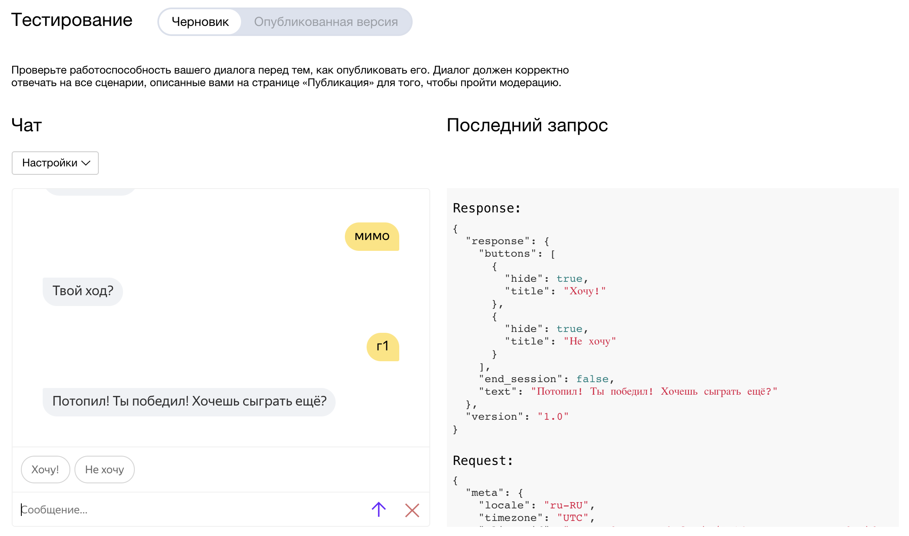

# Навык для Алисы: Морской бой

Аттестация преподавателей 2 года, проект Web

## ТЗ

Реализовать навык для Алисы для игры в морской бой.

## Приложение

Готовое, настроенное и запущенное приложение работает по адресу<br>
https://alice-battleship-skill.yumaa.dev/

Сам навык я не публиковал, т.к. по условию аттестации проекты должны быть анонимными, а при публикации обязательно указывать имя разработчика ¯\_(ツ)_/¯

## Установка и запуск

Разработка велась в Python 3.9, но должно работать и в 3.7+.

Используемые пакеты:
- Flask==1.1.2 — веб-сервер
- flask-redis==0.4.0 — клиент к Redis для храниения состояния
- APScheduler==3.7.0 — запуск периодических задач в фоне
- rich==10.1.0 — удобная поддержка цветов в консоли
- waitress==2.0.0 — Production веб-сервер для Flask приложений

Чтобы установить зависимости, из корня проекта нужно запустить
```
pip install -r requirements.txt
```
(на некоторых системах может быть `pip3` вместо `pip`)

Для корректной работы требуется установленный и запущенный [Redis](https://ru.wikipedia.org/wiki/Redis) — это очень быстрая NoSQL in-memory база данных. Она используется для хранения состояния приложения (вместо глобальных объектов, чтобы можно было безболезненно перезапускать сервер с сохранением состояния).

В разных системах установка и настройка Redis может отличаться, смотрите инструкцию на официальном сайте:

- **Docker** — самый простой и быстрый вариант, на мой взгляд, если у вас есть Docker — https://hub.docker.com/_/redis/:
```
docker run -p 6379:6379 redis:alpine
```
- **Debian/Ubuntu** — https://redis.io/download
- **Windows** — работа Redis на Windows не рекомендуется, но есть варианты — https://redislabs.com/ebook/appendix-a/a-3-installing-on-windows/a-3-2-installing-redis-on-window/

(Вообще, я думаю,что разработка веб приложений в принципе не рекомендуется на Windows, если только это не `ASP` и не `.Net`).

Для запуска на *nix системе можно из корня проекта запустить команду:
```
REDIS_URL="redis://localhost:6379/0" FLASK_APP=alice_battleship.skill FLASK_ENV=development flask run
```
При этом в переменной окружения REDIS_URL нужно задать актуальный адрес и порт Redis.

Работоспособность на Windows я не проверял, но можно попробовать запустить так:
```
set REDIS_URL="redis://localhost:6379/0"
set FLASK_APP=alice_battleship.skill
set FLASK_ENV=development
flask run
```

## Описание работы приложения

Основная точка входа, являющаяся WebHook'ом для Алисы, это `/talk`, принимающая корректный POST запрос от Алисы и отвечающая на него.

Помимо этой точки есть ещё пара для страничек, отображающих текущие игры, а также для описания:

- `/` — описание.
- `/games/` — отдаёт страничку где перечислены все текущие и недавно законченные игры.
- `/games.json` — отдаёт информацию в JSON виде для ↑ странички, для регулярного обновления информации.
- `/games/<session_id>` — показывает конкретную игру, текущий процесс или законченное состояние.
- `/games/<session_id>.json` — отдаёт информацию в JSON виде для ↑ странички, для регулярного обновления информации.

В начале диалога Алиса знакомится с игроком, если встречает его впервые, или приветствует, если такой игрок уже играл.

Сразу после начала игры Алиса даёт ссылку на текущую игру, чтобы можно было открыть и смотреть прогресс в браузере. Также в любой момент Алису можно спросить, где посмотреть игру.

Как выглядят поля на страничке `/games/<session_id>`:


Пример моей игры (я выиграл):


И окончание этой игры на страничке тестирования навыка:



Если игрок не отвечает больше 30 минут — игра автоматически заканчивается из-за неактивности игрока.

Законченные больше 3 часов назад игры удаляются.

## Тестирование алгоритма игры

Саму игру можно запустить абсолютно отдельно от веб сервера и Алисы, для этого из корня проекта нужно выполнить

```
python -m alice_battleship.test.game
```
(на некоторых системах может быть `python3` вместо `python`)

Это отдельный скрипт, который позволяет играть в морской бой в консоли, используя реализованный алгоритм. Диалог при этом отличается от Алисы (собственно, никакой Алисы в таком режиме нет), но вся игра такая же, как и с вебе.

## Тестирование навыка

Для тестирования навыка нужно:

1. Создать навык в [консоли разработчика](https://dialogs.yandex.ru/developer/)
2. Задать настройки навыка, указав адрес WebHook'а
3. На вкладке «Тестирование» попробовать поиграть

При этом нужно иметь ввиду несколько вещей:

- Веб-сервер, очевидно, должен быть доступен из интернета
- WebHook обязательно должен работать по протоколу HTTPS

Можно попробовать использовать `ngrok`, чтобы сделать локальный сервер доступным из интернета. Также можно посмотреть урок «Разворачиваем проект в облаке» для других вариантов.

Либо можете просто указать адрес моего развёрнутого сервера:<br>
https://alice-battleship-skill.yumaa.dev/talk

## Комментарии к реализации некоторых вещей

---

В уроке «Алиса — урок 1» написано, цитата:

> Давайте научимся сохранять данные журнала в файл. Еще раз напомним, что это — правильная практика, когда программа используется в боевом режиме (production), так как файл сохранится в случае остановки, падения или перезагрузки сервера.

В моём проекте логгирование **не** делается в файл и это сделано специально:<br>
В текущих реалиях делать логгирование в файл — это скорее _плохая_ практика. Приложение запускается в Docker'е, докер сам собирает stdout приложения и это уже забота Docker'а или Kubernetes'а, что делать с этими логами — собирать и писать в файлы или, например, отправлять в базу Elastic, откуда их будет агрегировать Kibana.<br>
Все приложения пишут логи в консоль и это позволяет сделать универсальный подход для сбора и обработки логов к любому приложению. Если же приложение будет писать логи в какой-то свой файл — это будет вставлять палки в колёса современным практикам проектирования инфраструктуры.

---

На страничке игры, где рисуются поля — они рисуются при помощи JavaScript на Canvas. С сервера приходят только данные в JSON.<br>
Изначально я думал рисовать картинку на сервере при помощи PIL, и отдавать в браузер файлом, но решил, что при обновлении раз в секунду это будет занимать очень много ресурсов + картинка будет весить гораздо больше, чем минимальный JSON с состоянием игры.<br>
Поэтому отрисовкой полей в браузере занимается JavaScript. Я понимаю, что это немного out-of-scope курса по питону, но мне хотелось сделать красиво и быстро :)

Обновление при этом делается просто опросом сервера раз в секунду. По хорошему, конечно, нужно было сделать через WebSockets, но в курсе веб-сокетов не было и я решил отложить это на потом. Тем более, что это ещё больше бы усложнило JavaScript часть, которая не идёт «в зачёт» :)

---

В контроллере, занимающемся обработкой запросов от Алисы, можно заметить, что я использую исключения (Exceptions) для управления потоком выполнения.<br>
В обычном мире это считается анти-паттерном, но в питоне это вполне обычная практика. Даже обычный цикл `for` при переборе элементов итератора _ожидает_, что при окончании перебора получит исключение `StopIteration`.

## Комментарий про _комментарии_

В коде довольно мало комментариев, я считаю, что почти весь код понятен и без них. А те, что есть — на английском языке. В одном из отзывов к моему первому проекту (PyQT) одного из проверяющих "смутили комментарии в коде на английском языке" (почти цитата).<br>
Дело в том, что комментарии в коде на русском языке вызывают у меня органическое отторжение. Английский язык международный и де-факто язык всей ИТ индустрии.<br>
А не признак копирования кода откуда либо :).
